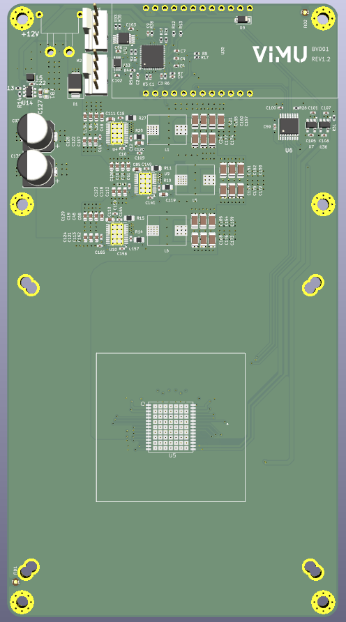
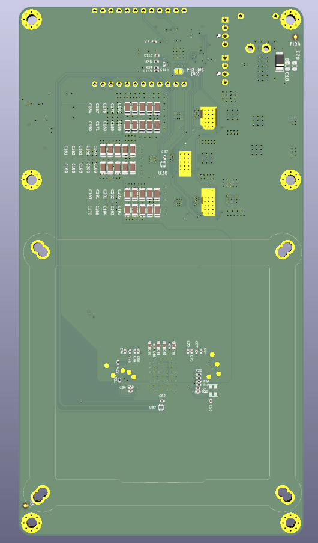
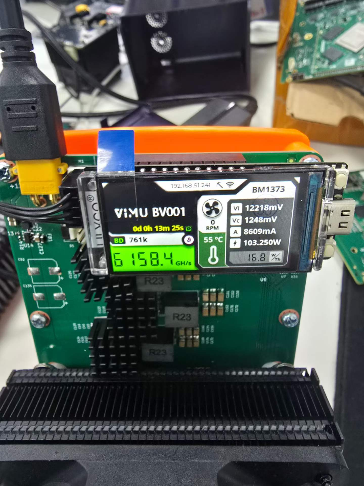

# BV001

Design by nerdqaxeplus2(https://github.com/shufps/qaxe), change the ASIC to 1 x BM1373 AA (6.1TH/s SHA256)

Design tested and validated.  
Consume about 110 Watts on 12V for about 6.1TH/s (Vcore 1250mV, frequency 900Hz).  
Run at 735 MHz and 1140 mV, power wall around 78W, efficiency 14J/Th, 5TH/s.  
Use a 12V 15A PSU.

---

# BV002

**It is still an untested prototype! Don't build this expecting it to work at all.**

---

# BV003

**It is still an untested prototype! Don't build this expecting it to work at all.**